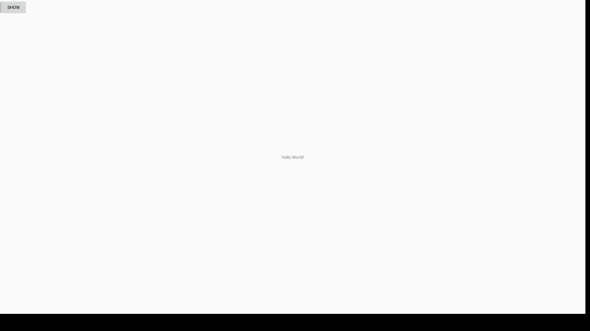

# AndroidAPI23NavBarIssue

Reproduction of a fullscreen mode issue.

Min SDK Version: 21
Target SDK Version: 23

Example code:  https://developer.android.com/training/system-ui/immersive#java

Incorrect rendering (Target SDK Version 23 on Project Celadon).

Correct rendering (Target SDK Version > 23 (Project Celadon) or one of a number of test devices).

